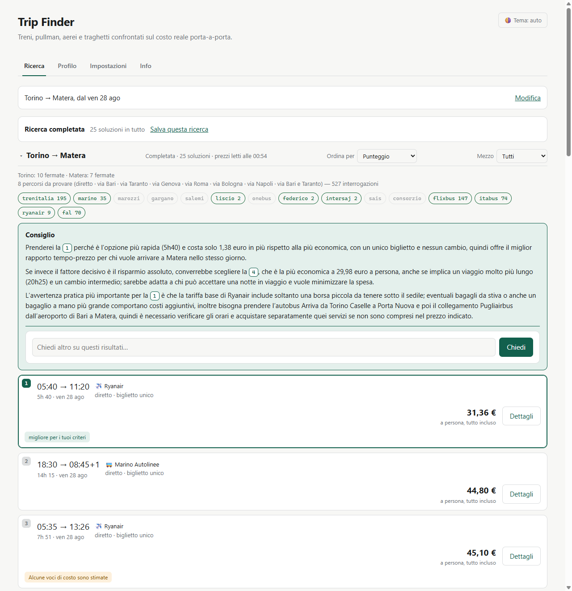

# Trip Finder

[](https://github.com/DiegoRiccardi1234/trip-finder/actions/workflows/tests.yml)
[](https://github.com/DiegoRiccardi1234/trip-finder/actions/workflows/tessere.yml)
[](https://github.com/DiegoRiccardi1234/trip-finder/releases/latest)

Motore di ricerca viaggi multimodale, da usare in locale. Confronta treni,
pullman, aerei e traghetti sul **costo reale porta a porta**, non sulla sola
tariffa, e compone itinerari che nessun singolo operatore ti mostra.

Si scarica e si fa doppio click: niente Python, niente terminale.
[**Scarica l'ultima versione per Windows**](https://github.com/DiegoRiccardi1234/trip-finder/releases/latest)



**English summary** — Trip Finder is a local-first, multimodal trip search
engine for Italy and its neighbours: 43 operator adapters across trains,
coaches, flights, ferries and local public transport, queried in parallel and
merged into a single ranking. What makes it different from an aggregator is the unit of comparison:
not the fare, but the **real door-to-door cost** — fare plus checked bag, plus
the ride to the first stop and from the last one, plus transfers between legs,
with every estimated item labelled as such. It also separates *changes* from
*tickets*: two separate tickets mean nobody rebooks you if the first leg is
late, so that risk is weighted in the ranking instead of hidden. This lets it
compose journeys no single operator sells — the case that drove the project is
Turin → Matera, a city with neither an airport nor a national-rail station. It
also plans journeys in stages, where each date follows the previous **arrival**:
a night coach lands the next day, and counting from the departure would restart
the trip before it got there.

Discount cards are treated as data that expires, because they are: of the
entries collected in August 2026, five carry a date, and two Trenitalia cards
stopped being sold that spring. So the catalogue is not typed, it is extracted
from the operators' own terms of carriage — public PDFs that carry the
percentage, the age limits and the validity window — and a weekly job re-reads
them and opens an issue when they drift. Better still, where an operator returns
its reduced fares inside the search response, the ranking uses **their** number
instead of estimating a percentage, and says so.

Every leg an adapter returns is checked against the pair that was actually
asked for — by geography, and by whether its duration is even physically
possible — because an adapter that quietly answers about somewhere else is
worse than one that fails: a search for Asti → Canelli, twenty-one kilometres
apart, once came back with an eighteen-hour coach between two towns six hundred
kilometres away, and nothing downstream noticed.

Stack: Python, FastAPI, SQLite, `curl_cffi` and Playwright for the harder
operators, and an LLM for the comparative advice — which you can now also talk
back to, asking about the ranking in front of you — eleven providers tried in a
chain, free tiers first, queued per host, with per-(provider, model) penalties
learned at runtime so a model that truncates JSON on one host is not written off
on another. Any one API key is enough, entered from the settings tab, and none
at all is fine too: when the advice cannot be produced the page says why instead
of going quiet. The test suite runs offline on saved fixtures. Please read the
legal note at the bottom before using it.

---

Il caso che ha guidato il progetto è Torino → Matera. Matera non ha né aeroporto
né stazione delle Ferrovie dello Stato: ci si arriva solo con la ferrovia locale
FAL da Bari, con un pullman a lunga percorrenza, o volando su Bari e prendendo la
navetta. Nessun operatore ti dice tutto questo, e gli aggregatori sbagliano il
confronto perché ignorano bagaglio e ultimo miglio.

Cosa restituisce, per il 14 agosto 2026 (25 itinerari, i primi cinque — è la
ricerca nell'immagine qui sopra):

| | Soluzione | Porta a porta | Totale a persona |
|---|---|---|---|
| 1 | Marino Autolinee, pullman notturno diretto | 14h 15 | 66,40 € |
| 2 | Itabus, un cambio — **il più economico** | 20h 25 | **56,98 €** |
| 3 | Volo Ryanair su Bari + navetta — **il più rapido** | 5h 40 | 100,73 € |
| 4 | Volo Ryanair notturno su Bari + navetta | 8h 11 | 83,74 € |
| 5 | FlixBus, un cambio | 18h 15 | 86,97 € |

I prezzi sono quelli di una ricerca vera, non un esempio scritto a mano: cambiano
ogni giorno, e in agosto salgono man mano che i pullman si riempiono.

I primi risultati non sono semplicemente i più alti in classifica: sono **il
migliore di ogni famiglia di soluzione**, più il più economico e il più rapido
in assoluto. Una classifica per solo punteggio mostrerebbe sei varianti di
pullman e nasconderebbe il volo.

Il volo "da 91,73 €" diventa 100,73 € perché include i 3 € del bus per Caselle e
i 6 € della navetta da Bari a Matera. È il tipo di differenza che ribalta una
scelta — e il pullman Itabus a 56,98 € nessun aggregatore te lo mette accanto a
un volo.

---

## Avvio

### Se vuoi solo usarlo (Windows)

Scarica `TripFinder-windows.zip` dall'[ultima release][release], scompattalo dove
preferisci, doppio click su `TripFinder.exe`. Non serve Python, non serve un
terminale, non serve la rete al primo avvio: i cataloghi delle fermate sono già
dentro l'archivio.

Il browser si apre da solo e compare una bussola nell'area di notifica. Tutto
quello che il programma scrive — profilo, ricerche salvate, chiavi, log — sta
nella cartella `data/` accanto all'eseguibile: si sposta con lui e si cancella
con lui. Dalle impostazioni si controlla se è uscita una versione nuova, e
l'aggiornamento sostituisce il programma senza toccare `data/`.

[release]: https://github.com/DiegoRiccardi1234/trip-finder/releases/latest

### Se vuoi lavorarci

Serve Python 3.11 o superiore.

```powershell
python -m venv .venv
.\.venv\Scripts\python.exe -m pip install -r requirements.txt
.\.venv\Scripts\python.exe scripts\fetch_datasets.py
.\.venv\Scripts\python.exe -m uvicorn app.main:app --reload --port 8010
```

Poi apri <http://127.0.0.1:8010/>. Oppure, più corto: `.\start.ps1`.

I tre dataset (circa 37 MB) si scaricano una volta sola e non stanno nel
repository. Il primo avvio impiega un paio di secondi a costruire l'indice
geografico: 62.000 fermate e 44.000 località, di cui 34.000 dal mondo.

I comandi sono in PowerShell perché l'avvio senza console, con l'icona nell'area
di notifica, è pensato per Windows (`pystray`). Su Linux e macOS funziona tutto
il resto identico: stesse dipendenze, `uvicorn app.main:app --port 8010`.

Per rifare il bundle: `pip install -r requirements-dev.txt` e poi
`python scripts\build_exe.py`. In CI lo fa `.github/workflows/release.yml` a ogni
tag `v*`, e allega lo zip alla release.

### Facoltativo: l'intelligenza artificiale

Il posto normale è la scheda **Impostazioni** del sito: una scheda per
fornitore, il link dove procurarsi la chiave e cosa dà il piano gratuito. Ne
basta **una**. Le chiavi restano su questo computer, in
`data/local_secrets.json`, e valgono subito — niente riavvio.

Chi lavora al codice può usare `.env` (copia `.env.example`): fra i due vince
quello salvato dal sito, perché chi ha appena premuto Salva si aspetta che valga
adesso.

Senza nessuna chiave il sito funziona identico, solo senza il consiglio finale e
senza la ricerca in linguaggio naturale. **Quando l'IA non risponde la pagina lo
dice**, con il motivo: nessuna chiave, fornitore che ha rifiutato, risposta
troncata. Prima il blocco spariva e basta, e l'IA rotta era indistinguibile
dall'IA assente.

E il motivo porta con sé il rimedio giusto, che non è sempre lo stesso: se manca
la chiave si va nelle impostazioni, se ha sbagliato il modello si **riprova** —
un tentativo parte da solo, poi resta il bottone. Riprovare serve davvero perché
il server ha appena penalizzato la coppia (fornitore, modello) che ha fallito, e
al giro dopo ne tocca un'altra.

I fornitori a pagamento restano spenti anche con la chiave inserita, finché non
si accende l'interruttore nelle impostazioni: metterli in fondo alla fila non
bastava, perché una giornata storta dei gratuiti li faceva scattare lo stesso.

I fornitori configurati si provano **in catena, i gratuiti per primi**, e
l'ordine alterna un fornitore e l'altro invece di esaurirne uno. Non è un
vezzo: sui piani gratuiti un `429` non è la tua quota, è il throttle dell'host,
condiviso con tutti quelli che lo stanno usando in quel momento — e quando
arriva riguarda di solito *tutti* i modelli di quel fornitore. Con una chiave
sola il consiglio semplicemente non arriva; con due, la richiesta prosegue
sull'altro host.

```powershell
.\.venv\Scripts\python.exe scripts\try_health.py        # quali modelli sono vivi
.\.venv\Scripts\python.exe scripts\try_health.py --ask  # prova una chiamata vera
```

---

## Come è fatto

```
app/
  geo/          da "Torino" alle fermate reali, con gli ID di ogni operatore
  providers/    un file per operatore, isolati fra loro
  routing/      percorsi candidati, coincidenze, costo, classifica, tessere
  orchestrator/ esecuzione in parallelo, budget di tempo, cache, circuit breaker
  ai/           undici fornitori LLM in catena, con selezione modelli
  static/       una pagina, quattro schede, niente build
```

### Il pezzo che conta: la composizione

Interrogare un operatore è la parte facile. Il valore sta nel decidere **quali
tratte vale la pena chiedere** e nel **ricomporre** le risposte.

Su scala europea non si può provare ogni città come scalo. Il filtro è
geometrico: un hub è ammissibile solo se non allunga il viaggio oltre il 40%.
Ma la geometria da sola sbaglia proprio i casi che contano — per pura distanza
Genova batte Bari sulla Torino-Matera, pur non avendo alcun collegamento con
Matera. Per questo **i due hub più vicini alla destinazione entrano sempre**,
qualunque sia il loro punteggio. È la regola che rende trovabile questo viaggio.

### Il modello di costo

Il totale di ogni itinerario comprende:

- la tariffa di ogni tratta;
- il **bagaglio in stiva** dove si paga (45 € su Ryanair, zero sui treni): con o
  senza valigia vince un'opzione diversa;
- l'**avvicinamento** alla prima fermata e l'**ultimo miglio** dall'ultima. I
  collegamenti principali sono curati a mano in `routing/transfers.py`
  (Pugliairbus da Bari a Matera: 75 minuti, 6 €), gli altri sono stimati per
  distanza e marcati come tali;
- i **trasferimenti** fra una tratta e l'altra quando cambia la stazione;
- le **tessere** che hai dichiarato, che tolgono dal totale e quindi cambiano la
  classifica, non solo la cifra finale.

Ogni voce stimata è dichiarata. Una tratta di cui non conosciamo il prezzo non
vale zero: verrebbe premiata proprio perché ne sappiamo meno.

Lo stesso vale per i vincoli. Se nessuna soluzione rispetta quelli che hai messo
— «parti dopo le 13:30» su una tratta dove tutto quel che parte nel pomeriggio
arriva il giorno dopo — la ricerca mostra le migliori **fuori** vincolo invece di
una pagina vuota, e lo scrive sopra la classifica, dicendo quali vincoli ha messo
da parte. Solo quelli che le soluzioni a schermo violano davvero: avvisare di un
vincolo che non si vede violato è un avviso che non si può verificare.

### Il rischio, che è un criterio come gli altri

Torino → Bari con Trenitalia più Bari → Matera con FlixBus sono **due contratti**.
Se il treno ritarda, nessuno ti riprotegge sul pullman e il biglietto è perso.
Il motore lo segnala in rosso e lo pesa nella classifica, separando due cose che
si confondono di continuo:

- **cambi**: quante volte scendi e risali, inclusi quelli interni a un biglietto
  unico (un Frecciarossa con cambio a Bologna è un cambio, ma senza rischio);
- **biglietti**: quanti contratti separati compri. È questo che genera il rischio.

I margini minimi di coincidenza sono per modo: dieci minuti fra due treni, ma
110 minuti per prendere un aereo, perché il vincolo è il check-in.

### Il consiglio, che deve dire di quale soluzione parla

Una classifica ordinata non è una decisione: le prime tre sono spesso
incommensurabili, e il compromesso qualcuno deve dirlo ad alta voce. Il punto
difficile non è farlo scrivere a un modello, è farlo scrivere su **queste**
soluzioni.

Ogni scheda porta un numero, scritto in alto a sinistra e fissato a ricerca
conclusa. Il consiglio lo cita, e nel testo quel numero è un bottone: ci si
clicca e si finisce sulla scheda giusta, evidenziata. Il numero resta attaccato
alla soluzione anche riordinando per prezzo o filtrando il mezzo — un consiglio
già scritto continua a puntare dove deve.

Il modello riceve esattamente quello che è a schermo, perché è **la pagina** a
chiederlo, non il motore: coppie andata e ritorno con il prezzo sommato, quante
soluzioni ci sono in tutto, i vincoli che il motore ha dovuto mettere da parte,
gli avvisi in italiano e le note che rendono un prezzo condizionato. E le
differenze fra le soluzioni arrivano **già calcolate**: le sottrazioni fatte a
mente da un modello sono sbagliate abbastanza spesso, dentro frasi che sembrano
perfette.

Due controlli prima che il testo compaia: se cita una soluzione che non esiste,
o se non ne cita nessuna, la risposta si scarta e tocca a un altro modello.
Quando invece non arriva niente, la pagina dice il motivo e offre «Riprova».

Sotto il consiglio si può rispondere. «Perché non la 2? io i cambi li evito»,
«e a che ora arriva quella che mi hai consigliato?»: la conversazione vede la
stessa classifica del consiglio, più le preferenze del Profilo, e i riferimenti
restano cliccabili anche nelle risposte. Con un limite dichiarato, che è la
ragione per cui è difendibile: **non lancia ricerche e non tocca il modulo**.
Può parlare solo di quello che ha davanti, quindi non può inventare un
collegamento che non è stato trovato — se la risposta richiede altri parametri
lo dice, e la ricerca la rilanci tu.

### Le tessere, che sono un dato che scade

Una tessera non è un fatto stabile. Delle voci raccolte ad agosto 2026 cinque
portano una data dentro: le promo Young e Senior di Trenitalia valgono fino al
30 novembre, lo sconto ISIC su FlixBus fino al 15 dicembre, e la Carta Verde e
la Carta Argento **non si comprano più dal 4 aprile 2026**. Un elenco scritto a
mano oggi sbaglia in primavera, e sbaglia in silenzio: uno sconto mancato si
scopre con piacere alla cassa, uno inventato fa perdere il viaggio.

Quindi il catalogo non si digita. Si costruisce a tre strati, in ordine di
quanto ci si può contare.

**Il prezzo dell'operatore.** Trenitalia manda le sue tariffe ridotte dentro la
risposta di ricerca, col nome dell'offerta (`FrecciaYOUNG`, `SENIOR`): non
compaiono nel prezzo esposto perché il motore non sa se chi cerca ha la tessera.
Se l'hai dichiarata, la classifica usa **quella cifra**, per quella corsa e per
quel giorno, e la riga di costo dice «tariffa dell'operatore». Non invecchia,
perché non è una nostra stima. Su Torino → Roma questo porta il più economico
da 60,90 € a 39,00 €.

**Il catalogo estratto.** Per il resto servono le condizioni di trasporto degli
operatori: PDF pubblici, strutturati in paragrafi, che portano la percentuale,
i limiti di età e la finestra di validità — e che sono il documento che li
vincola. Vale più di qualunque pagina riassuntiva: quelle dicevano che la Carta
Verde è sparita il 1° aprile, il PDF dice il 4. `scripts/build_tessere.py` li
legge e scrive `app/routing/data/tessere.json`, versionato apposta perché una
modifica si veda nel diff. Come per gli orari FAL, valida prima di scrivere e
**fallisce senza scrivere**: un catalogo mezzo estratto è peggio di uno vecchio,
perché quello vecchio almeno lo sai.

**Il controllo settimanale.** Il lunedì mattina un workflow rilegge le fonti e
confronta con il file versionato. Se una percentuale cambia, se una tessera
sparisce o se una scade, apre un issue. È l'unico modo perché qualcuno se ne
accorga: nessuno va a rileggersi le condizioni di trasporto di sua iniziativa.

Quello che nessun operatore pubblica in forma leggibile resta scritto a mano,
ma con la fonte e la data in cui è stato guardato, e dopo sei mesi l'interfaccia
lo marca «da riverificare». Una voce scaduta non sparisce dall'elenco: chi ha
una Carta Verde emessa a marzo la sta ancora usando.

Nel profilo le tessere si scelgono da un menu invece di ricordarsele: scegliendo
la Promo Young il modulo si riempie da solo con il 20% e con il 30 novembre, e
accanto compare cosa serve per averla (la Carta X-GO, gratuita) e il link al
documento da cui viene.

### Viaggi a tappe

«Da Matera a Roma per tre giorni, poi a Torino» è una frase sola, e non è
esprimibile ripetendo una ricerca: la data di una tappa **dipende** dalla
precedente. Le tappe si cercano in fila, e la partenza di ognuna nasce
dall'**arrivo** di quella prima più i giorni di sosta.

L'arrivo, non la partenza: un pullman notturno che parte il 24 alle 23:35 arriva
alle 07:37 del **25**, e contando dalla partenza il viaggio ripartirebbe il 27,
cioè prima di essere arrivato. In fondo c'è il totale del viaggio e un consiglio
su come stanno insieme le tappe, che è la cosa che le classifiche singole non
possono dire.

---

## Gli operatori

Ogni adapter è un plugin isolato: se il suo parser si rompe, gli altri
continuano a funzionare e la ricerca degrada invece di fallire.

**43 adapter.** L'ultima corsa di `scripts/check_providers.py` (22 agosto 2026,
data di prova 5 settembre) ne dà **32 verdi e 11 vuoti**: gli undici sono tutti
operatori regionali della piattaforma Albatross, che sulla loro tratta di prova
quel giorno non avevano corse. Un `VUOTO` non è necessariamente un parser rotto
— molti di questi fanno una corsa al giorno o viaggiano a stagione — ma **non è
nemmeno un verde**, e vale la pena rileggerlo prima di fidarsene.

Nove sono autonomi:

| Operatore | Cosa dà |
|---|---|
| **Trenitalia** (backend di lefrecce.it) | orari e prezzi |
| **FlixBus** | orari e prezzi |
| **Itabus** | orari e prezzi |
| **Ryanair** (Fare Finder) | la tariffa più bassa del giorno |
| **FAL** | l'unico treno che arriva a Matera: orari **e tariffe** dai PDF ufficiali |
| **Grimaldi Lines** | il primo traghetto di linea vero, con il prezzo |
| **ÖBB** | l'orario austriaco, compresi i diretti Vienna–Venezia. Senza prezzi |
| **SBB CFF FFS** | l'orario svizzero, compreso Zurigo–Milano. Senza prezzi |
| **Transitous** | il trasporto pubblico locale, dai dati aperti che gli enti pubblicano. Senza prezzi |

Gli altri trentaquattro sono **un solo adapter**. Molti operatori di pullman
italiani non hanno un sito ciascuno: usano lo stesso motore di prenotazione,
distribuito su un host per operatore. Stessa API, stesso formato. Da lì
arrivano Marino, Marozzi, Autolinee Federico, Liscio, SAIS, InterSAJ, Ferrovie
del Gargano, Cortina Express, Tiemme, Giuntabus e una ventina d'altri —
**inclusi tre traghetti** (Liberty Lines per Egadi ed Eolie, Blu Navy per
l'Elba, Ichnusa per la Corsica).

Aggiungerne un altro costa una riga nella tabella `OPERATORS` di
`providers/bus/albatross.py`, più una tratta di prova verificata. Per trovare
sia l'una sia l'altra c'è `scripts/probe_albatross.py`, che parte dagli
operatori già noti, ne legge i vettori collegati e prova le coppie di località
ricavate dalle **linee reali** invece di tentare a caso.

### Transitous: il pezzo che mancava, e come si sta a casa d'altri

Una ricerca **Asti → Canelli** — ventun chilometri — non aveva nessuno che
sapesse rispondere. Trenitalia dice il vero quando risponde «nessuna soluzione»
(quella tratta in treno non esiste), FlixBus non ci passa, e l'unico mezzo
pubblico è un autobus di linea. Transitous quella corsa la sa: linea 41,
quarantacinque minuti.

Sotto c'è MOTIS, un motore libero alimentato dai GTFS aperti che gli enti
pubblicano. Non è un'azienda: è un servizio di volontari, che dichiara il
routing «resource-intensive» e chiede di essere avvisato prima che qualcuno
cominci a fare molte richieste. Da qui una **disciplina di richiesta** scritta
nel codice invece che affidata alle buone intenzioni: l'adapter tace sulle
coincidenze intermedie, tace sopra i 150 km (misurato: la lunga percorrenza
torna comunque vuota), ragiona per città invece che per fermata, e tiene la
risposta in cache sei ore. Il risultato è **una richiesta per ricerca**, non
una per coppia di fermate. In più: un `User-Agent` che dice chi siamo e come
scriverci, un tetto di una richiesta ogni due secondi e mai due in volo
insieme, e l'attribuzione delle fonti in fondo alla pagina, che è un obbligo
della loro licenza e non un ringraziamento.

### Quelli che non ci sono, e perché

**Parte degli operatori europei è murato.** Verificato sondando gli endpoint
reali, con l'evidenza in [`docs/operatori.md`](docs/operatori.md); il metodo con
cui si aprono, e le trappole che sono costate di più, stanno in
[`docs/note-tecniche.md`](docs/note-tecniche.md):

| Operatore | Cosa risponde |
|---|---|
| Italo | `401 Invalid token x`; il browser automatizzato non carica nemmeno il sito (`ERR_HTTP2_PROTOCOL_ERROR`) |
| Deutsche Bahn | `403 OPS_BLOCKED`, anche chiamando da dentro una pagina del sito |
| Trainline | captcha DataDome |
| easyJet / Wizz Air | sfida anti-bot / endpoint spostato |
| GNV, SNAV | API mappate nei loro bundle, ma ogni percorso risponde `401`: manca la sessione |
| Volotea | il token anonimo si ottiene, la ricerca risponde `500` per uno stato di sessione mancante |
| Tirrenia, Direct Ferries | rispondono, ma con dati parziali: partenze senza orario di arrivo né prezzo |
| Omio | percorsi API cambiati |

L'infrastruttura per superarli c'è: `providers/browser_base.py` offre due classi
base, una che chiama un'API **da dentro** una pagina del sito ereditandone
cookie e token, una che compila il modulo di ricerca e legge il DOM. Restano da
usare, sito per sito.

**Un operatore murato non viene però taciuto.** Chi cerca Torino–Roma e non
vede Italo può concludere che non esista. Quelli di cui sappiamo con certezza
che coprono una tratta stanno in `providers/known_routes.json`, e la ricerca li
mostra a parte, fuori dalla classifica e con il link al loro sito: *"anche
questi collegano le due città, ma i loro orari vanno visti da loro"*. La
copertura non è mai dichiarata a occhio — o l'operatore è nei dataset con i
propri identificatori di stazione, o le sue rotte vengono dai suoi documenti
pubblici.

### FAL: quando l'unica fonte è un PDF

Ferrovie Appulo Lucane non ha API. `scripts/build_fal_schedule.py` scarica il
manifesto ufficiale e ne ricava un orario versionato, lavorando sulle coordinate
dei caratteri (il rilevamento tabelle su quel documento produce celle fuse).

Conta più degli orari quello che ci sta intorno, e viene dal manifesto stesso:
il servizio **non circola la domenica né nei festivi**, i treni marcati `(1)`
sono **soppressi dal 27 luglio al 29 agosto** — cioè in pieno agosto — e la
tratta Bari–Gravina è **interrotta**, coperta da autobus sostitutivi. L'adapter
applica queste condizioni prima di produrre qualunque risultato: proporre un
treno che quel giorno non parte è peggio che non proporlo.

Lo script valida prima di scrivere (orari crescenti, durate plausibili,
capolinea attesi) e in caso di dubbio **fallisce senza scrivere niente**.

Dallo stesso sito arriva anche il **listino**, che è un secondo PDF. FAL non
vende a tratta ma a fascia chilometrica: servono insieme la tabella delle
distanze tassabili e quella delle fasce. Bari–Matera sono 70 km tassabili, cioè
6,20 €. Se il listino non regge i suoi controlli, lo script scrive gli orari
**senza** i prezzi: l'adapter lo dichiara e il costo torna a essere una stima,
invece di diventare un numero inventato.

### Aggiungere un operatore

Un file sotto `app/providers/<modo>/`, una classe con `@register`, due metodi:

```python
@register
class MioOperatore(Provider):
    id = "mio"
    name = "Mio Operatore"
    mode = Mode.BUS
    tier = 1                       # 2 se serve il browser

    async def fetch(self, origin, destination, ctx):
        return await ctx.http.get_json(URL, params={...})

    def parse(self, raw, origin, destination, ctx):
        return [Leg(...) for ... in raw["results"]]
```

`fetch` e `parse` sono separati apposta: `parse` è sincrono, non tocca la rete e
gira sulle fixture salvate. È la parte che si rompe quando il sito cambia, e
deve essere verificabile senza internet.

Regole: gli orari devono avere il fuso (un orario senza fuso è un bug
dell'adapter, non un caso da gestire a valle); non aggiungere supplementi ai
prezzi, ci pensa `routing/cost.py` in modo uniforme; una lista vuota significa
"ho cercato e non c'è niente", che è diverso da `NotServed`.

---

## Diagnostica

```powershell
# dove si traduce una località
.\.venv\Scripts\python.exe scripts\try_resolve.py Torino Matera

# un singolo adapter dal vivo, e --save congela la risposta come fixture
.\.venv\Scripts\python.exe scripts\try_provider.py trenitalia Torino Bari 2026-08-14
.\.venv\Scripts\python.exe scripts\try_provider.py --list

# cerca altri operatori sulla piattaforma Albatross, con la loro tratta di prova
.\.venv\Scripts\python.exe scripts\probe_albatross.py --discover-only

# una ricerca completa senza avviare il server
.\.venv\Scripts\python.exe scripts\try_search.py Torino Matera 2026-08-14 --bag

# quali fornitori LLM sono vivi e in che ordine; --ask chiama davvero
.\.venv\Scripts\python.exe scripts\try_health.py --ask

# rilegge le condizioni di trasporto e rigenera il catalogo delle tessere
.\.venv\Scripts\python.exe scripts\build_tessere.py
.\.venv\Scripts\python.exe scripts\build_tessere.py --check   # solo confronto

# i test: parser su fixture, motore su dati sintetici, nessuna rete
.\.venv\Scripts\python.exe -m pytest tests -q
```

`try_provider.py` è lo strumento principale quando qualcosa si rompe. Con
`--save` la risposta grezza finisce in `tests/fixtures/` e il test del parser
gira su quella: quando un operatore cambia formato, il test dice esattamente
cosa è cambiato.

Dalla API: `/api/providers` mostra lo stato dei circuiti, `/api/ai/models` i
modelli con la loro salute pubblicata, `/api/tessere` il catalogo con le
scadenze, `/api/resolve?q=Matera` la risoluzione di una località.

Se un adapter si rompe, il suo circuito si apre per qualche minuto e viene
segnalato nella UI. Per riaprirlo dopo averlo sistemato:
`POST /api/providers/reset`.

---

## Prestazioni

Una ricerca Torino → Matera genera 8 percorsi candidati e circa 520
interrogazioni verso gli operatori. Misurata con i valori di default: i primi
**25 itinerari sono a schermo dopo 6-7 secondi**, e la ricerca si dichiara
completata intorno ai 30 secondi a cache fredda, 16 con la cache calda. La coda
non sono i risultati, sono gli operatori più lenti che chiudono: i risultati
intanto sono già in classifica, che si riordina in streaming man mano che
arrivano. Il consiglio dell'IA non è dentro quel numero — lo chiede la pagina a
ricerca chiusa, e prima invece la ricerca non poteva dichiararsi finita finché
un modello non aveva risposto.

Tre manopole in `.env` se serve muoverle:

- `SEARCH_TIME_BUDGET` (90 s) — tetto rigido: chi non risponde entro viene
  dichiarato in timeout nella UI, mai nascosto. I primi risultati arrivano molto
  prima, perché a chiudere la prima ondata è `FAST_BUDGET` (20 s);
- `DOMAIN_RATE_LIMIT` (4/s per dominio) — il vero collo di bottiglia: a 1/s la
  stessa ricerca dura circa quattro volte tanto;
- `SEARCH_MAX_CONCURRENCY` (20) — richieste in volo in tutta la ricerca. Può
  essere alta senza far danno, perché quello che protegge i singoli operatori è
  il limite per dominio, non questo.

La cache SQLite usa scadenze diverse per tipo di dato: 15 minuti per i prezzi,
6 ore per gli orari, 30 giorni per la mappatura fra una fermata e l'ID di un
operatore.

---

## Nota legale

I dati vengono letti dagli endpoint pubblici dei siti degli operatori, e i
termini di servizio di molti di loro limitano l'accesso automatico. È uno
strumento personale e locale, a basso volume, con un limite di richieste per
dominio e una cache aggressiva proprio per non pesare sui loro server: nessuna
credenziale, nessun acquisto automatizzato, nessun aggiramento di protezioni —
dove c'è un captcha o una sessione autenticata l'operatore resta fuori, e in
`docs/operatori.md` sta scritto quale e perché. I dati non vengono
redistribuiti, e non esiste alcun servizio pubblico costruito su questo codice.

I dataset geografici sono di terzi e conservano la loro licenza: le stazioni
sono di [Trainline EU](https://github.com/trainline-eu/stations) (ODbL), gli
aeroporti di [OurAirports](https://ourairports.com/data/) (pubblico dominio), e
le città del mondo di [GeoNames](https://www.geonames.org/) (CC BY 4.0). Si
scaricano dalle rispettive fonti al primo avvio e non vengono ridistribuiti.

Se rappresenti un operatore e vuoi che il suo adapter venga rimosso, apri una
issue: lo togliamo.

I prezzi vanno sempre riverificati sul sito dell'operatore prima di comprare:
cambiano fra la ricerca e l'acquisto, e le tariffe più basse hanno spesso
condizioni restrittive.
